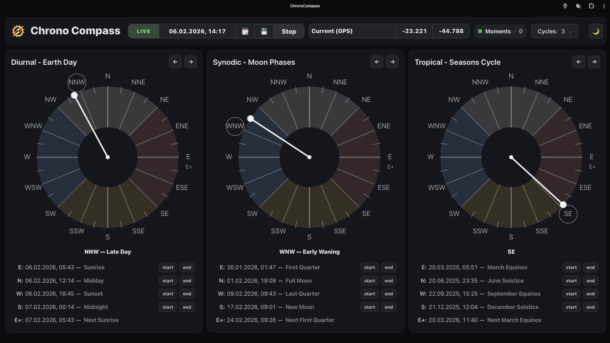

# ChronoCompass

## 🌐 Translations

- 🇬🇧 **English** — main documentation (this README)
- 🇷🇺 **Русский** — [docs/ru/README.md](docs/ru/README.md)

**ChronoCompass** is an experimental visual time instrument that treats time as a system of **interacting cycles**, rather than a single linear stream.

Instead of asking *“what time is it?”*, ChronoCompass helps you explore **where you are inside multiple temporal cycles at once**.

  

Days, lunar phases, years, and long-term astronomical cycles are represented as **rotating wheels**, all aligned to a shared **compass-based model** (East / North / West / South).  
The result is a tool for navigating time spatially, structurally, and intuitively.

---

## ✨ Core Concept

At its core, ChronoCompass aims to establish a **simple, logical, precise, and accessible standard**  
for representing diverse temporal cycles using a **single unified compass model**.

Different cycles remain physically independent, but are mapped onto a shared directional structure, making their relationships, drift, and resonance immediately visible.

For a detailed conceptual overview, see:

- **Concept & model:**  
  → [`docs/en/CONCEPT.md`](docs/en/CONCEPT.md)

- **Key terms and definitions:**  
  → [`docs/en/GLOSSARY.md`](docs/en/GLOSSARY.md)

---

## 🧭 Key Ideas

- Time as **cycles**, not a timeline
- Orientation through **directions** (E / N / W / S + intermediates)
- **Multiple cycles** running simultaneously, without forced synchronization
- Clear separation between **PAST**, **FUTURE**, and **LIVE (now)**
- One visual language for:
  - daily rhythms,
  - lunar motion,
  - seasonal change,
  - long astronomical cycles
- Minimal UI, high semantic density

---

## 🔄 Cycles Visualized

ChronoCompass currently supports multiple independent cycles, including:

- **Diurnal Cycle** (Earth rotation)  
  → [`docs/en/cycles/diurnal.md`](docs/en/cycles/diurnal.md)

- **Lunar Synodic Cycle** (Moon phases)  
  → [`docs/en/cycles/lunar-synodic.md`](docs/en/cycles/lunar-synodic.md)

- **Lunar Anomalistic Cycle** (Moon distance)  
  → [`docs/en/cycles/lunar-anomalistic.md`](docs/en/cycles/lunar-anomalistic.md)

- **Lunar Draconic Cycle** (orbital nodes, eclipses)  
  → [`docs/en/cycles/lunar-draconic.md`](docs/en/cycles/lunar-draconic.md)

- **Solar Tropical Cycle** (seasons)  
  → [`docs/en/cycles/solar-tropical.md`](docs/en/cycles/solar-tropical.md)

- **Solar Anomalistic Cycle** (Earth–Sun distance)  
  → [`docs/en/cycles/solar-anomalistic.md`](docs/en/cycles/solar-anomalistic.md)

- **Platonic / Precessional Cycle** (axial precession)  
  → [`docs/en/cycles/plato.md`](docs/en/cycles/plato.md)

Each cycle:
- has its own anchors and physical meaning,
- may define directions astronomically or mathematically,
- is **not forced to align** with other cycles.

---

## 🧩 Directions, Houses, Meaning

All cycles are mapped onto the same structural model:

- **16 compass directions** (E, ENE, NE, …, S, …)
- **16 houses**, centered on those directions
- Houses may have **unequal duration**, depending on the cycle
- Main directions (E / N / W / S) act as **structural anchors**

The semantic meaning of directions (e.g. visibility, gravity, transition, balance)  
emerges consistently across different cycles.

For philosophical and interpretative background, see:
- [`docs/en/philosophy/wheels.md`](docs/en/philosophy/wheels.md)
- [`docs/en/philosophy/elements.md`](docs/en/philosophy/elements.md)
- [`docs/en/philosophy/precession.md`](docs/en/philosophy/precession.md)

---

## 🧪 What You Can Do

- Navigate freely through **past and future**
- Switch between **LIVE mode** (following the present) and manual exploration
- Work with **multiple Earth locations** (manual or automatic)
- Visualize how different cycles:
  - align,
  - drift,
  - resonate over time
- Save **moments** with names and descriptions
- Create **collections** of moments:
  - periodic (birthdays, yearly events, custom cycles),
  - non-periodic (historical or future timestamps)
- Show or hide collections per wheel and compare them visually

---

## 📡 Offline-First

ChronoCompass is designed to work **fully offline**.

- All calculations are done locally
- No internet is required for normal use
- Can be installed as a **Progressive Web App (PWA)**

Network access is used only for:
- checking updates,
- optional automatic location detection

---

## 🛠 Tech Stack

- **Svelte**
- **TypeScript**
- Minimal dependencies (no heavy date libraries)
- Astronomical calculations via deterministic algorithms
- CSS variables for theming (light / dark)
- Designed for desktop, tablet, and mobile layouts

UI layout concepts are documented here:
- [`docs/en/ui/desktop.md`](docs/en/ui/desktop.md)
- [`docs/en/ui/tablet.md`](docs/en/ui/tablet.md)
- [`docs/en/ui/mobile.md`](docs/en/ui/mobile.md)

---

## 🎯 Project Status

ChronoCompass is a **research and exploration project**.

- APIs may change
- Internal models may evolve
- Visual language is still being refined

It is intended as a foundation for:
- alternative time interfaces,
- educational tools,
- scientific visualization,
- creative and philosophical exploration,
- worldbuilding systems,
- experimental calendars.

---

## 📜 License

MIT — use it, fork it, remix it, break it, rebuild it.  
Attribution appreciated but not required.

---

If you’re interested in time as a **navigable space** rather than a ticking counter — welcome.